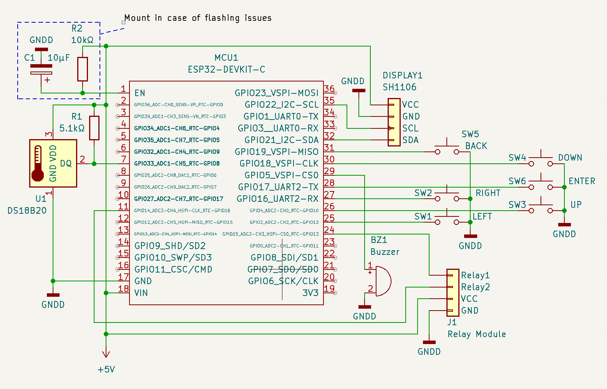

The purpose of this project is to automate simple rectification equipment.

Hardware part is based on Espressif ESP32 MCU and software part is based on ESP-IDF framework and FreeRTOS, implementing asynchronous event-driven architecture.

# Prerequisites

It is assumed that the ESP-IDF 4.4.1 framework is installed at the default path (`~/esp/esp-idf`) and <a href="https://github.com/UncleRus/esp-idf-lib">esp-idf-lib</a> is installed at `~/esp/esp-idf-lib`. <a href="https://docs.espressif.com/projects/esp-idf/en/stable/esp32/get-started/index.html#installation-step-by-step">Follow this guide to install ESP-IDF.</a>

## Equipment

This project was developed and tested on a rectification column made of glass with a diameter of 50mm, a length of 1500mm, filled with a 3.5x3.5mm spiral prismatic packing, with a temperature sensor installed at a distance of 500mm from the bottom. Column set up on top of 25L steel tank with 2kW induction plate.

## Electronic components

* 1x Espressif ESP32 DevKitC board (`esp32-wroom-32d`/`esp32-wroom-32u`)
* 1x DS18B20 temperature sensor in metal sleeve with wiring
* 1x SH1106 or compatible I2C display
* 1x 5.1kΩ pull-up resistor
* 1x 12V 2-channel **[NO]** relay module
* 2x 12V **[NC]** water valves
* 1x 12V DC power supply (for valves and relays)
* 1x 12V/5V DC/DC converter module **OR** Micro-USB power supply (for MCU, display and sensors)
* 6x **[NO]** push buttons
* 1x Passive buzzer (not required but useful)

Some ESP32 boards have flashing issues (flashing won't start or stucks at random time), in that case you should mount the following additional components:

* 1x 10kΩ pull-up resistor (R2)
* 1x 10µF capacitor (C1)

With this mod you will be able to flash MCU flawlessly and without pressing the FLASH button.

# Schematic

# Operating principle

The control program is in fact a finite state machine. Each state corresponds to the real physical state of the equipment.

1. **Warming up and initial stabilization.** The liquid is heated up to the boiling point which is detected by the rising and then constant temperature for a given time. Then the transition to the stabilization state is applied.
2. **Initial stabilization.** Constant temperature monitoring is applied.  When the temperature became constant and does not exceed the limit within the set time, stabilization is considered successful and collection of the ether-aldehyde fraction begins. Otherwise the process stops and message "Unable to stabilize" displayed.
3. **Collection of the ether-aldehyde fraction (heads).** The first valve (calibrated for a lower throughput) opens and filling of the first container begins. In the current version operator should watch when the ether-aldehyde fraction ends and transit to the next state manually using the control button.
4. **Collection of the body (hearts).** The ether-aldehyde fraction valve closes, and the main valve (calibrated for a higher throughput) opens and the filling of the second container begins. During the collection process, the temperature is monitored. If the temperature exceeds the threshold, a transition to the stabilization state is applied (see below). If stabilization succeeds, the transition to the collection of the body is applied. If stabilization fails, the entire process is considered complete.
5. **Stabilization.** This state is entered from collection of the body if temperature conditions are not met. When the temperature became constant and does not exceed the limit within the set time, stabilization is considered successful and collection of the body resumes, otherwise (or if the temperature rises fast) the transition to "completed" state is applied.
6. **Collection completed.** Both valves are closed. This is the final state and no transition to any state is allowed (unless manually triggered by button).

### TO DO:

* Automate collection of ether-aldehyde fraction
* Implement barometric compensation
* Implement heating element power switching
* Implement cooling water supply valve switching / cooling pump and fan switching
* Implement emergency monitoring (overheating, overflow, water leak, ethanol vapor, smoke, etc.)
* Implement remote control over Wi-Fi/Bluetooth connection
